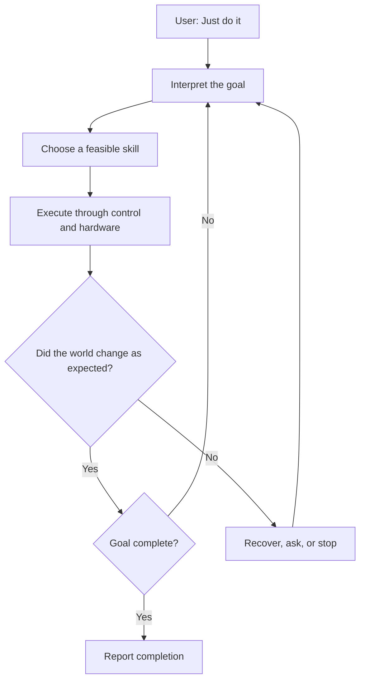

In many online games, **auto-play** turns a vague objective into hours of unattended action. The player chooses a destination, a monster, or a reward. The game handles the rest.

It works because the game is a closed world. The available actions are known. Health, position, inventory, and enemy state are directly readable. Collisions follow fixed rules. If the character fails, the game can respawn it into a valid state.

When people ask for a useful home robot, they often want the physical version of the same button:

> Clean the kitchen.
>
> Put away the groceries.
>
> Bring me water.
>
> Just do it for me.

The sentence is short because the user has compressed an entire task graph into an outcome. The robot has not been told which cup to use, whether the dishwasher is already full, how to open an unfamiliar cabinet, what to do when the bottle slips, or when it should stop and ask for help.

That missing information is not a minor implementation detail. **It is the autonomy problem.**

## A longer policy is not the same as more autonomy

Recent robot-learning systems have made real progress in connecting language, perception, and action. SayCan showed how a language model can sequence skills while grounding its choices in what the robot can physically execute.[1] RT-2 showed that web-scale visual and language knowledge can improve semantic generalization in robot control.[2] Open X-Embodiment demonstrated positive transfer from data collected across 22 different robot embodiments.[3]

These are important steps toward robots that understand broader instructions. But understanding _what should happen_ is not the same as maintaining a valid physical process until it has happened.

Consider the instruction “put the mug in the dishwasher.” A reasonable plan might be:

1. find the mug,
2. approach it,
3. grasp it,
4. navigate to the dishwasher,
5. open the door,
6. pull out the rack,
7. place the mug,
8. verify that the mug is stable,
9. close the dishwasher.

Each line hides its own perception, motion, contact, and control problem. Worse, the steps are coupled. A grasp that is barely stable may survive the first lift but fail when the mobile base turns. A navigation error of a few centimeters may leave the arm near a kinematic limit. A cabinet hinge with more friction than expected may convert a planned pulling motion into a base disturbance.

If a task contains $N$ required transitions and transition $i$ succeeds with probability $p_i$, a deliberately simple approximation is

$$
P(\text{task success}) \approx \prod_{i=1}^{N} p_i.
$$

The failures are not truly independent, so this is not a model to use for prediction. It is a useful warning. Even at $p_i = 0.99$, one hundred required transitions give

$$
0.99^{100} \approx 0.366.
$$

Long-horizon autonomy therefore cannot be built by making every open-loop action slightly better and hoping the product becomes reliable. The system has to **observe intermediate outcomes, detect when reality has diverged from the plan, and change what it does next**.

## The real unit of autonomy is a verified state transition

A robot skill is often described by its command: `grasp`, `open_door`, `navigate_to`, or `place`. That is only the forward half of the interface.

A useful skill needs at least five parts:

| Skill contract    | Question                                                                     |
| ----------------- | ---------------------------------------------------------------------------- |
| Preconditions     | Is this skill valid from the current physical state?                         |
| Command           | What reference or action should the robot execute?                           |
| Success predicate | What observable evidence proves that the world changed as intended?          |
| Failure predicate | What evidence says that continuing is unlikely or unsafe?                    |
| Recovery exits    | Should the robot retry, choose another skill, replan, ask for help, or stop? |

Without these boundaries, a skill library is closer to a collection of macros than an autonomous system.

A gripper closing is not evidence that an object was grasped. The motor may have hit a position limit, squeezed empty space, or contacted the object in a configuration that cannot survive the next acceleration. A door-handle trajectory completing is not evidence that the door opened. The handle may have slipped, the latch may still be engaged, or the mobile base may have moved instead.

This distinction changes the architecture. The robot must close a loop around **task progress**, not only around joint position or end-effector pose.

Inner Monologue made this feedback idea explicit by giving a language-model planner information about success, failure, and scene changes so it could replan.[4] The important idea is broader than any particular language model: **a plan becomes physically meaningful only when execution can change the planner's belief about the world**.

## Between the prompt and the world is an entire robot

The phrase “just do it” makes the robot appear to have one input and one output:

$$
\text{instruction} \rightarrow \text{completed task}.
$$

The actual path is closer to

$$
\begin{aligned}
\text{instruction}
&\rightarrow \text{goal representation}
\rightarrow \text{task plan}
\rightarrow \text{skill target} \\
&\rightarrow \text{motion and force references}
\rightarrow \text{low-level command}
\rightarrow \text{actuator output} \\
&\rightarrow \text{contact}
\rightarrow \text{sensing}
\rightarrow \text{state estimation}
\rightarrow \text{verification}.
\end{aligned}
$$

Every arrow can fail while the software above it continues to look reasonable.

The planner may choose the correct object but the camera may lose it during occlusion. The motion planner may produce a collision-free path but the real payload may shift the arm enough to clip the environment. The controller may request a feasible joint torque while the motor drive is already thermally derating the available current. The gripper may apply the intended motor current while gearbox friction and fingertip geometry produce the wrong contact force.

This is why I use a broad definition of robot hardware. It includes the mechanism, actuators, sensors, communication, and embedded control, but also the low-level estimation and stabilization layers required to make the higher-level action interface true. They may be software in a repository. Operationally, they are part of the robot's physical contract.

## Hardware makes the action interface state-dependent

A policy would like the same observation and action to produce the same transition. Real robots rarely provide that stationarity for free.

Motor resistance changes with temperature. Available voltage headroom changes with battery state and motor speed. Gearbox friction depends on direction, load, lubrication, and wear. Backlash changes which side of the transmission is engaged. A soft fingertip changes contact area and frictional stability as it deforms. Camera calibration and joint zero offsets drift. Communication delay and sensing jitter change the phase margin of the closed loop.

Some of these states are measured. Many are only partially observable. To the high-level policy, they appear as an action that “sometimes works.”

This matters more over long tasks than in a short demonstration. The robot that begins an episode is not necessarily the robot that exists twenty minutes later. Its motors are warmer, its battery voltage is lower, objects have moved, contacts have accumulated small errors, and the next skill starts from a state that was produced by every previous skill.

Large datasets help expose some of this variation. DROID collected 76,000 real-robot trajectories over 350 hours, across 564 scenes and 84 tasks.[5] Open X-Embodiment aggregates experience across many platforms.[3] Those scales are impressive precisely because real robot data is expensive: it needs hardware, operators, resets, safety procedures, calibration, and physical maintenance.

Data can teach a model a broader distribution. It cannot make the embodiment disappear. A policy action is still realized through a particular actuator, transmission, controller, sensor layout, and contact geometry. When those change, the physical meaning of the data changes with them.

## Recovery needs an owner

When a robot drops an object, which layer owns the failure?

The grasp policy may say that its trajectory ended normally. The arm controller may report zero tracking error. The motor drives may be healthy. The task planner may still believe the object is in the gripper. Every component can be locally correct while the robot is globally wrong.

Reliable autonomy needs explicit ownership across timescales:

| Layer                         | What it should own                                                           |
| ----------------------------- | ---------------------------------------------------------------------------- |
| Drive and actuator protection | current, voltage, temperature, communication, and hard limits                |
| Low-level controller          | stable tracking, impedance, contact-force limits, and safe fallback commands |
| Skill executor                | preconditions, timeouts, local success checks, and bounded retries           |
| State estimator / verifier    | object, contact, robot, and task-state evidence                              |
| Task planner                  | sequencing, alternative skills, and replanning after changed conditions      |
| Safety supervisor             | conditions that override all other objectives                                |
| Human interface               | escalation when the robot cannot recover with acceptable risk                |

This does not require every boundary to be hand-coded forever. A learned policy can own a skill, a planner can be model-based or language-based, and a verifier can be learned from images and force histories. The important part is that failure does not fall into an architectural gap.

A timeout with no owner becomes a frozen robot. A grasp failure with no verifier becomes a confidently wrong task state. A low battery warning with no planning consequence becomes a robot that starts a task it cannot finish.

## Demos usually hide the reset button

Robot demonstrations are naturally edited around successful episodes. The environment begins in a prepared state. The object is reachable. The robot is calibrated. A human resets the scene after failure.

That is a valid way to evaluate a skill, but it is not the same as evaluating unattended operation.

Mobile ALOHA demonstrated impressive bimanual mobile-manipulation tasks and reported over 80% success on several tasks with 50 demonstrations and co-training.[6] The paper also clearly states an important boundary: the learned policies were still single-task imitation-learning systems and did not autonomously improve or explore to acquire new knowledge.[6]

BEHAVIOR-1K reaches toward the larger problem by defining 1,000 everyday activities in realistic environments. Its authors emphasize that these activities are long-horizon and depend on complex manipulation skills, remaining difficult for current systems.[7]

The gap between a strong task demo and “just do it for me” is not an argument against learning. It tells us what must surround a learned policy:

- a way to decide whether the policy is applicable,
- a way to verify what it changed,
- a way to preserve safety when its output is wrong,
- a way to recover from reachable failures,
- and a way to recognize when recovery is no longer justified.

## Building the auto-play button

Game auto-play works because someone has already engineered the world into machine-readable states, legal actions, success conditions, and resets.

The physical world offers none of those interfaces by default. A cup does not publish `grasped = true`. A cabinet does not expose its hinge friction. A wet plate does not announce that the friction coefficient has changed. The robot has to infer these facts through imperfect sensing while its own hardware changes the interaction.

So the useful question is not:

> When will one model become intelligent enough to do everything?

A better engineering question is:

> What physical and software contracts must remain true for this robot to continue acting without human intervention?

That question leads to less magical but more useful work: better contact design, observable skill outcomes, robust low-level control, hardware monitoring, explicit recovery paths, and planners that can revise their assumptions.

The most autonomous robot is not the one that can generate the longest sequence of actions. It is the one that can notice when reality disagrees with the sequence—and still choose the next sensible thing to do.

## References

[1] M. Ahn et al., “Do As I Can, Not As I Say: Grounding Language in Robotic Affordances,” _Conference on Robot Learning_, 2022. [arXiv:2204.01691](https://arxiv.org/abs/2204.01691)

[2] A. Brohan et al., “RT-2: Vision-Language-Action Models Transfer Web Knowledge to Robotic Control,” _Conference on Robot Learning_, 2023. [arXiv:2307.15818](https://arxiv.org/abs/2307.15818)

[3] Open X-Embodiment Collaboration et al., “Open X-Embodiment: Robotic Learning Datasets and RT-X Models,” 2023. [arXiv:2310.08864](https://arxiv.org/abs/2310.08864)

[4] W. Huang et al., “Inner Monologue: Embodied Reasoning through Planning with Language Models,” _Conference on Robot Learning_, 2022. [arXiv:2207.05608](https://arxiv.org/abs/2207.05608)

[5] A. Khazatsky et al., “DROID: A Large-Scale In-The-Wild Robot Manipulation Dataset,” 2024. [arXiv:2403.12945](https://arxiv.org/abs/2403.12945)

[6] Z. Fu, T. Z. Zhao, and C. Finn, “Mobile ALOHA: Learning Bimanual Mobile Manipulation with Low-Cost Whole-Body Teleoperation,” 2024. [arXiv:2401.02117](https://arxiv.org/abs/2401.02117)

[7] C. Li et al., “BEHAVIOR-1K: A Human-Centered, Embodied AI Benchmark with 1,000 Everyday Activities and Realistic Simulation,” 2024. [arXiv:2403.09227](https://arxiv.org/abs/2403.09227)
