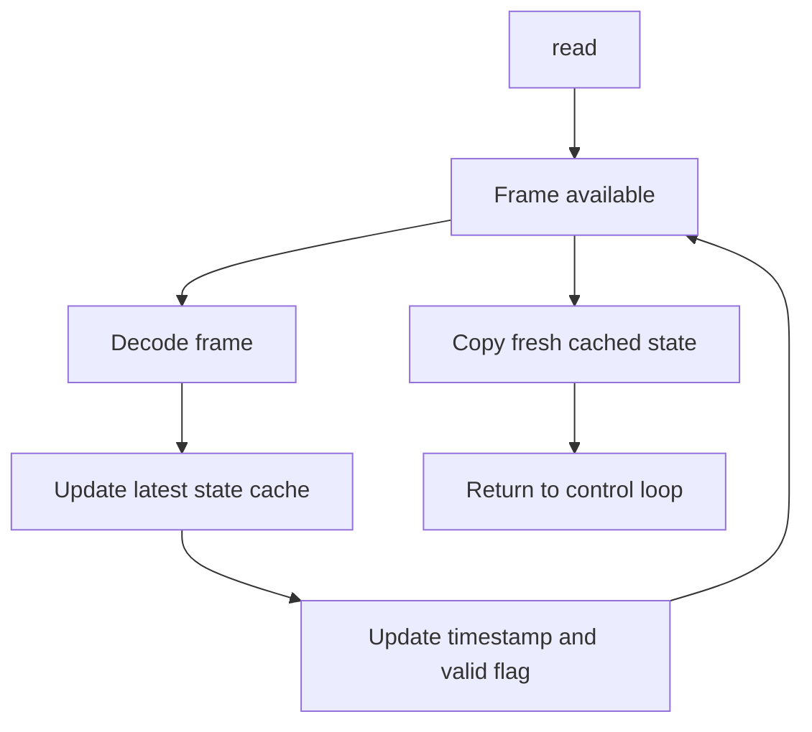
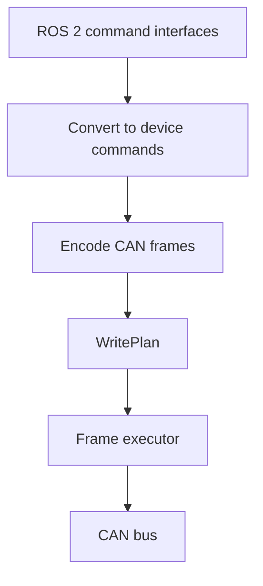

Previous Posts:

- [What Is CAN?](/can01/)
- [Setting up SocketCAN on Linux](/can02/)
- [Communicating with an ESP32 Using SocketCAN](/can03/)
- [Gripper Motor Control with CAN Bus](/can04/)
- [PCAN Device Driver Installation on Linux](/can05/)
- [From CAN Frames to ROS 2 Control](/can06/)

## Overview

In the previous post, we discussed the basic role of a ROS 2 Control hardware interface.

```text
read()
  hardware feedback → ROS 2 state

write()
  ROS 2 command → hardware command
```

For CAN-based hardware, this becomes:

```text
read()
  CAN frame → decoded joint state

write()
  joint command → encoded CAN frame
```

This description is correct, but incomplete.

In practice, the difficult part is not only encoding and decoding CAN frames. The difficult part is deciding:

```text
- when to read
- when to write
- how often to write
- how to handle incoming bursts
- how to avoid blocking the control loop
- how to detect stale feedback
- how to avoid overwhelming the actuator driver
```

A CAN hardware interface is therefore not just a protocol translator. It is also an I/O scheduling layer between an event-driven CAN bus and a periodic control loop.


## Control Loops Are Periodic, CAN Frames Are Not

A controller usually runs at a fixed rate.

CAN traffic does not necessarily follow the same timing. Frames arrive when devices send them. Some devices broadcast periodically. Some only respond to queries. Some reply after receiving commands.

The hardware interface must connect these two timing models.

```text
CAN side:
  asynchronous frame stream

ROS 2 Control side:
  periodic read → update → write loop
```

This is the main reason CAN I/O logic needs explicit design.

## Common CAN I/O Patterns

Before implementing `read()` and `write()`, the device I/O pattern should be identified.

Most CAN devices used in robot hardware follow one of three patterns.

| Pattern            | Description                                                                      | Typical Devices                                |
| ------------------ | -------------------------------------------------------------------------------- | ---------------------------------------------- |
| Periodic broadcast | The device sends state at a fixed rate without being asked.                      | sensors, IMUs, encoder boards                  |
| Query-response     | The host sends a query, and the device replies with state or configuration data. | diagnostics, parameter reads, low-rate devices |
| Command-response   | The host sends a command, and the device replies with feedback.                  | motor drivers, smart actuators                 |

The important point is not the message shape itself. The important point is whether the hardware interface can treat the data as a cached stream, a blocking request, or feedback tied to command timing.

## Pattern 1: Periodic Broadcast

In this pattern, the device sends state using its own internal timer.

This pattern is common for sensors.

```text
Examples:
- IMU
- force sensor
- tactile sensor board
- encoder board
- temperature monitor
```

The host does not request every sample. The hardware interface should collect incoming frames and update the latest-state cache.

The main risk is that frames arrive faster than the application drains them. If the receive buffer accumulates old frames, the controller may use stale data even though the device is still transmitting correctly.

## Pattern 2: Query-Response

In this pattern, the host explicitly requests data.

This pattern is useful for diagnostics, configuration reads, and low-rate data.

```text
Examples:
- firmware version
- device parameter read
- diagnostic status
- error code request
- calibration data
```

It is usually not ideal as the main mechanism for high-rate joint feedback.

A blocking query inside `read()` can delay the control loop.

```text
read()
  send query
  wait for response   <- control loop can block here
  decode response
  update state
```

A safer structure is to keep query-response logic outside the main periodic control path.

## Pattern 3: Command-Response

In this pattern, the host sends a command and the device returns feedback.

This pattern is common for motor drivers and smart actuator modules.

The command frame may contain:

```text
- desired position
- desired velocity
- control gains
- feedforward torque
- mode command
```

The response frame may contain:

```text
- measured position
- measured velocity
- measured current
- temperature
- status flags
```

This pattern maps naturally to a control loop.

However, the feedback frame should not automatically be interpreted as the state after the command has been applied.

Depending on the driver firmware, the response may contain:

```text
- the latest measured state before the command was applied
- the latest measured state after the command was accepted
- a cached state from the actuator control loop
- a status packet generated independently of the command timing
```

The hardware interface should treat the response as timestamped feedback, not as a perfectly synchronized result of the command.

## I/O Frequency Is a Hardware Constraint

The update frequency of a CAN hardware interface should not be chosen only from the ROS 2 control rate.

It must also consider:

```text
- CAN bitrate
- number of devices on the bus
- number of frames per device
- feedback frame rate
- command frame rate
- frame size
- driver-side receive buffer
- firmware parsing rate
- actuator control-loop rate
```

A common mistake is to assume that if the ROS 2 controller runs at 1 kHz, every actuator command should also be sent at 1 kHz.

That is not always possible or useful.

For example, with 8 actuators:

```text
8 command frames × 1000 Hz = 8000 command frames/s
8 feedback frames × 1000 Hz = 8000 feedback frames/s
```

This gives 16000 frames/s before considering diagnostics, retransmissions, or protocol overhead.

Even if the host CAN adapter accepts the outgoing frames, the actuator driver may not process them reliably if they arrive as a burst.

```text
Host PC
  -> kernel TX queue
  -> CAN adapter
  -> CAN bus
  -> motor driver RX
  -> firmware parser
  -> command may be ignored or overwritten
```

A successful `CAN_Write()` or socket `write()` call means the frame was accepted by the host-side transmit path. It does not necessarily mean the actuator firmware consumed and applied the command.

This distinction matters when several frames are sent back-to-back.

```cpp
for (const auto& frame : command_frames) {
  can_socket.writeFrame(frame);
}
```

This can create a burst.

When eight command frames are written back-to-back, the bus may still serialize them correctly, but the receiving firmware may experience them as a dense burst at its RX path.

For this reason, the transmit path often needs pacing.

```cpp
for (const auto& frame : command_frames) {
  can_socket.writeFrame(frame);
  sleep_for(tx_frame_delay);
}
```

The delay does not need to be large. The correct value depends on the CAN adapter, bus bitrate, actuator driver, and firmware implementation.

The goal is not to slow the robot unnecessarily. The goal is to avoid sending bursts that the receiving device cannot process.

The correct command rate and inter-frame delay must be tuned on the actual hardware.

Two devices can use the same CAN bitrate and still behave differently.

```text
Same CAN bitrate
Same number of command frames
Different actuator firmware
Different RX buffer size
Different parser timing
Different result
```

This difference is often strongly hardware-dependent. High-end motor drivers may handle dense traffic, deeper buffering, and bursty command streams. Cheaper actuator modules may have smaller receive buffers, slower firmware loops, or weaker handling of back-to-back frames.

CAN I/O frequency should therefore be treated as a hardware parameter, not only a software parameter.

## Blocking vs Non-Blocking Read

A direct blocking read is simple.

```cpp
can_frame frame;
read(socket_fd, &frame, sizeof(frame));
decode(frame);
```

However, if no frame is available, the call can block.

This is usually not acceptable inside a periodic control loop.

A non-blocking read avoids this.

```cpp
can_frame frame;

while (can_socket.readFrameNonBlocking(frame)) {
  decode(frame);
}
```

The idea is to drain all currently available frames without waiting for new ones.



This pattern is useful when the control loop itself is responsible for polling RX frames.

## Latest-State Cache

The controller should not depend on a specific CAN frame arriving exactly during the current `read()` call.

A more robust structure is to maintain a latest-state cache.

The cache stores the most recent valid feedback per device.

```cpp
struct DeviceFeedback
{
  double position;
  double velocity;
  double effort;
  rclcpp::Time stamp;
  bool valid;
};

std::vector<DeviceFeedback> latest_feedback_;
```

Then `read()` copies the latest valid feedback into ROS 2 state interfaces.

```cpp
hardware_interface::return_type CanSystem::read(
  const rclcpp::Time& time,
  const rclcpp::Duration& period)
{
  can_frame frame;

  while (can_bus_.readFrameNonBlocking(frame)) {
    const auto feedback = protocol_.decodeFeedback(frame);
    latest_feedback_[feedback.device_id] = feedback;
    latest_feedback_[feedback.device_id].stamp = time;
    latest_feedback_[feedback.device_id].valid = true;
  }

  for (size_t i = 0; i < latest_feedback_.size(); ++i) {
    hw_positions_[i] = latest_feedback_[i].position;
    hw_velocities_[i] = latest_feedback_[i].velocity;
    hw_efforts_[i] = latest_feedback_[i].effort;
  }

  return hardware_interface::return_type::OK;
}
```

The cache should also support freshness checks.

```cpp
bool is_fresh =
  (time - latest_feedback_[i].stamp) < rx_stale_timeout_;
```

A decoded value is not always a usable value. It must also be recent enough.

## WritePlan and TX Pacing

The transmit path should be explicit.

Instead of writing CAN frames directly in several places, the hardware interface can build a write plan and pass it to a frame executor.



A simple write plan may contain:

```cpp
struct WritePlan
{
  std::vector<can_frame> frames;
  std::chrono::microseconds inter_frame_delay;
  std::chrono::microseconds frame_timeout;
};
```

The hardware-specific `write()` function builds the plan.

```cpp
hardware_interface::return_type CanSystem::write(
  const rclcpp::Time& time,
  const rclcpp::Duration& period)
{
  WritePlan plan;

  for (size_t i = 0; i < hw_commands_.size(); ++i) {
    plan.frames.push_back(
      protocol_.encodeCommand(i, hw_commands_[i]));
  }

  plan.inter_frame_delay = tx_frame_delay_;
  plan.frame_timeout = tx_frame_timeout_;

  if (!frame_executor_.execute(plan)) {
    return hardware_interface::return_type::ERROR;
  }

  return hardware_interface::return_type::OK;
}
```

The executor applies the transmit policy.

```cpp
bool CanFrameExecutor::execute(const WritePlan& plan)
{
  for (const auto& frame : plan.frames) {
    if (!can_bus_.writeFrame(frame, plan.frame_timeout)) {
      return false;
    }

    if (plan.inter_frame_delay.count() > 0) {
      std::this_thread::sleep_for(plan.inter_frame_delay);
    }
  }

  return true;
}
```

This separation makes it easier to tune the transmit path without changing the controller or protocol code.

## Example CanSystem Structure

A useful structure is to separate raw CAN I/O, frame execution, and robot-specific hardware logic.

Each layer has a limited responsibility.

| Layer              | Responsibility                                           |
| ------------------ | -------------------------------------------------------- |
| `CanInterface`     | Direct access to SocketCAN, PCAN, or another CAN backend |
| `CanBus`           | RX polling, TX sending, optional observer dispatch       |
| `CanFrameExecutor` | TX execution, pacing, timeout handling, RX freshness     |
| `CanSystemBase`    | Common `read()` / `write()` structure                    |
| `CanSystem`        | Robot-specific command conversion and state update       |

The base class keeps the main structure small.

```cpp
bool CanSystemBase::read()
{
  const bool ok = update_measurements_();
  refresh_state_snapshot_();
  return ok;
}

bool CanSystemBase::write()
{
  WritePlan plan;

  plan.ready = commands_are_valid();
  if (!plan.ready) {
    invalidate_previous_commands();
    return true;
  }

  build_write_plan_(plan);
  store_previous_commands();

  return execute_write_plan_(plan);
}
```

The concrete system provides the hardware-specific hooks.

```cpp
bool CanSystem::update_measurements_()
{
  return frame_executor_.poll_rx();
}
```

Incoming frames can be dispatched through an observer.

```cpp
can_bus_.add_rx_observer([this](const CanFrame& frame) {
  std::lock_guard<std::mutex> lock(state_mutex_);

  if (protocol_.dispatch_rx_frame(frame, devices_)) {
    frame_executor_.mark_rx_frame();
  }
});
```

The receive path becomes:

The state snapshot can include both decoded joint state and hardware health information.

```cpp
void CanSystem::refresh_state_snapshot_()
{
  std::lock_guard<std::mutex> lock(state_mutex_);

  update_joint_states_from_devices();

  state_snapshot_.stamp = now();
  state_snapshot_.has_fresh_rx =
    frame_executor_.has_fresh_rx(rx_stale_timeout_);
  state_snapshot_.transport_healthy =
    frame_executor_.transport_healthy();

  copy_joint_state_to_snapshot();
}
```

The write path is similarly separated.

```cpp
void CanSystem::build_write_plan_(WritePlan& plan)
{
  std::lock_guard<std::mutex> lock(state_mutex_);

  convert_joint_commands_to_device_commands();

  protocol_.append_command_frames(
    devices_,
    device_commands_,
    plan.frames);

  plan.inter_frame_delay = tx_frame_delay_;
  plan.frame_timeout = tx_frame_timeout_;
}
```

Then the executor sends the frames.

```cpp
bool CanSystem::execute_write_plan_(const WritePlan& plan)
{
  return frame_executor_.execute(plan);
}
```

The full write path is:

This structure avoids putting all transport, protocol, timing, and robot-specific logic directly inside `read()` and `write()`.

## Tuning Procedure

A practical tuning process is:

```text
1. Start with a conservative command rate.
2. Add inter-frame delay between command frames.
3. Check that every device responds consistently.
4. Monitor stale feedback and missed responses.
5. Increase command frequency gradually.
6. Reduce inter-frame delay only after the bus and drivers are stable.
7. Re-test with all devices enabled, not only one actuator.
```

The final values should be selected based on measured hardware behavior.

Important parameters include:

```text
- control loop rate
- command transmission rate
- feedback rate
- inter-frame TX delay
- RX stale timeout
- TX frame timeout
- maximum allowed missing feedback count
```

These values are not universal. They depend on the adapter, bus topology, device firmware, and actuator hardware.

## USB-CAN Converter Bottleneck

Many prototype robots use USB-CAN converters.

This is convenient, but it adds another layer between the control loop and the CAN bus.

```text
ROS 2 hardware interface
  -> OS scheduler and driver
  -> USB stack
  -> USB-CAN converter
  -> CAN bus
  -> actuator driver
```

Even if the CAN bus is configured at 1 Mbps, the host application is not directly writing bits onto the CAN wires. Frames pass through the operating system, USB stack, converter firmware, and driver buffers before reaching the bus.

This can introduce:

```text
- additional latency
- timing jitter
- transmit buffering
- receive buffering
- bursty frame delivery
- device-dependent throughput limits
```

This is important when the hardware interface sends many frames at a high rate.

From the application side, several writes may return successfully.

```cpp
for (const auto& frame : frames) {
  can_interface.writeFrame(frame);
}
```

However, this does not guarantee that the frames were placed on the CAN bus with the intended spacing. The USB-CAN converter may buffer them and transmit them later, sometimes in a burst.

This matters for actuator drivers with limited receive buffering or slow command parsing.

```text
Application write succeeds
  ≠ frame transmitted immediately
  ≠ actuator firmware processed the command
```

The bottleneck is not always the nominal CAN bitrate.

For high-rate control, the limiting factor may be:

```text
- USB-CAN converter firmware
- USB polling interval
- driver implementation
- host-side queue size
- converter-side TX buffer
- converter-side RX buffer
- application read frequency
```

Different USB-CAN converters can behave very differently. Some devices handle dense traffic and timestamping well. Others are acceptable for diagnostics but unreliable for high-rate multi-actuator control.

This difference is often more visible when the system scales from one actuator to many actuators.

```text
One actuator:
  low bus load
  low burst pressure
  most converters appear to work

Eight actuators:
  higher command rate
  higher feedback rate
  more bursts
  converter behavior becomes important
```

For this reason, USB-CAN converter selection should be treated as part of the hardware design, not just as a cable choice.

When using a USB-CAN converter, the hardware interface should be tuned with the converter in the loop.

Practical checks include:

```text
- test with all actuators enabled
- monitor missed feedback
- monitor stale state events
- increase command rate gradually
- add inter-frame delay if needed
- compare behavior across converters if possible
- avoid assuming that successful host writes imply successful device processing
```

For low-rate diagnostics, most USB-CAN converters are sufficient.
For high-rate multi-actuator control, the converter can become the bottleneck even when the CAN bitrate looks adequate.

## Summary

A CAN hardware interface is not only an encoding and decoding layer.

It must also define the I/O timing policy.

The main points are:

```text
- CAN devices follow different I/O patterns.
- Periodic broadcast, query-response, and command-response require different read/write logic.
- Blocking reads should be avoided inside a periodic control loop.
- Incoming frames should be drained and stored in a latest-state cache.
- Command frames may need inter-frame delay to avoid burst problems.
- A successful host-side CAN write does not guarantee actuator firmware processing.
- Command frequency and TX pacing must be tuned on real hardware.
```

A useful design separates the system into:

```text
CanInterface
  raw CAN backend

CanBus
  RX/TX transport

CanFrameExecutor
  pacing, timeout, freshness

CanSystem
  ROS 2 Control hardware interface
```
