---

title: '[CAN 08] - How to Debug "I Think the Hardware Is Broken"'
description: A practical CAN debugging checklist for narrowing  hardware failures
layout: distill
published: true
date: 2024-09-15 00:00:00
img: /assets/img/can/socketcan.jpg
permalink: /can08/
series: "CAN Bus for Robotic Hardware"
series_order: 8
tags: [Hardware Development]

# categories: robotics101

---

Previous Posts:

* [What is CAN?](/can01/)
* [Setting up SocketCAN on Linux](/can02/)
* [SocketCAN Communication with ESP32](/can03/)
* [Gripper Motor Control with CAN Bus](/can04/)
* [PCAN Device Driver Installation on Linux](/can05/)
* [From CAN Frames to ROS 2 Control](/can06/)
* [CAN I/O Logic in ROS 2 Hardware Interfaces](/can07/)

## Overview

Most hardware debugging starts with an imprecise statement.

```text
I think the hardware is broken.
```

This may be true.
But it is not yet a useful debugging statement.

In a CAN-based robot, the failure can be in many places.

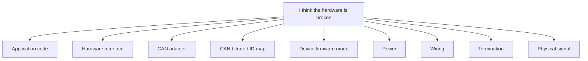

The goal is not to immediately prove that the hardware is broken.

The goal is to turn a vague failure into a smaller, testable statement.

```text
Bad:
  I think the hardware is broken.

Better:
  No CAN frames are visible in candump.

Better:
  Feedback frames are visible, but command frames do not change actuator state.

Better:
  TX error counter increases when sending commands.

Better:
  The bus works with one actuator but fails when all actuators are connected.

Better:
  CANH-CANL resistance is 120 Ω instead of 60 Ω.
```

This post follows one practical rule:

```text
Start with the least invasive check.
Move toward the physical layer only when the previous layer cannot explain the failure.
```

In other words, do not start by disassembling the robot.
Do not start by replacing the motor driver.
Do not start with an oscilloscope unless there is a reason to go that low.

Start by observing the bus.

## Debugging Flow

The debugging flow should move from easy observations to more invasive measurements.

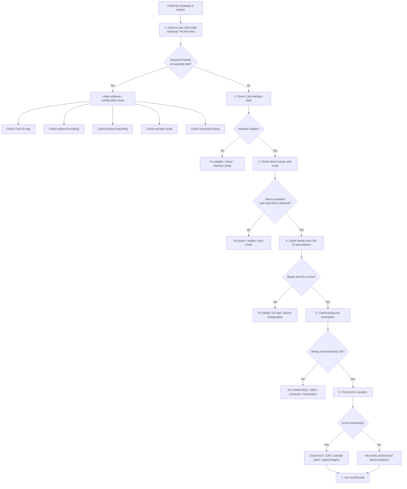

This flowchart is not the only possible debugging sequence. It is a conservative one. It tries to avoid unnecessary hardware disassembly by using observable evidence first.

## Step 1: Observe Raw CAN Traffic

Start with the simplest observable signal.

On Linux with SocketCAN:

```bash
candump can0
```

With PCAN tools, use PCAN-View and select the correct channel and bitrate.

The first question is:

```text
Do I receive the expected CAN frames
at the expected rate
with the expected CAN IDs?
```

This one question immediately separates many failure modes.

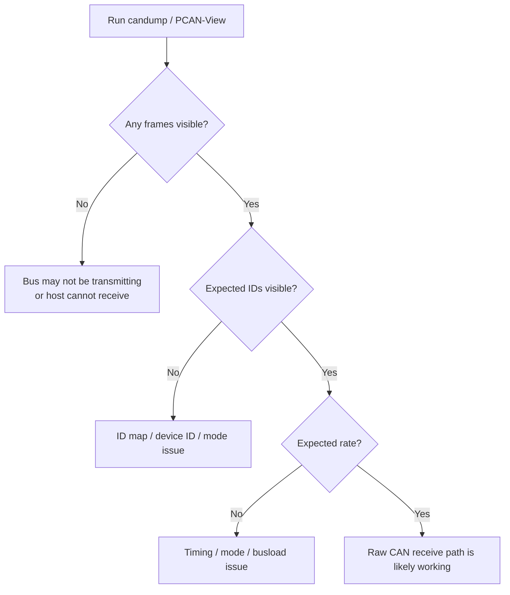

Look for three things:

```text
1. Are frames visible?
2. Are the expected CAN IDs visible?
3. Are they arriving at the expected rate?
```

Example:

```text
Expected:
  ID 0x201 at 500 Hz

Observed:
  ID 0x201 at 500 Hz
```

This means the CAN bus, device transmission, adapter, and basic receive path are probably working.

The remaining problem may be software-side.

Possible causes include:

```text
- wrong CAN ID map
- wrong byte order
- wrong scaling
- wrong command mode
- wrong enable sequence
- wrong joint-to-actuator mapping
- timeout threshold too strict
- controller frequency mismatch
- TX pacing problem
```

If the expected frames are visible, do not open the robot yet. Check the protocol and software assumptions first.

## Step 2: Understand the Device I/O Pattern

No traffic in `candump` does not always mean the bus is broken.

Some devices broadcast periodically.
Some devices only respond to queries.
Some devices only respond after a command.

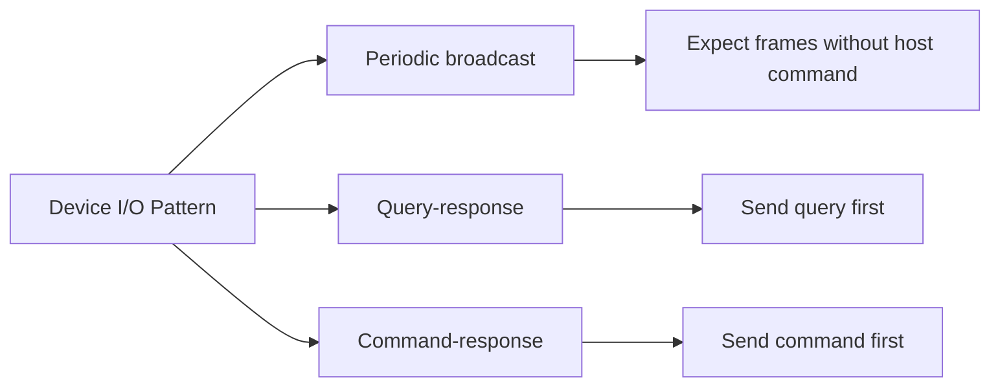

### Periodic Broadcast

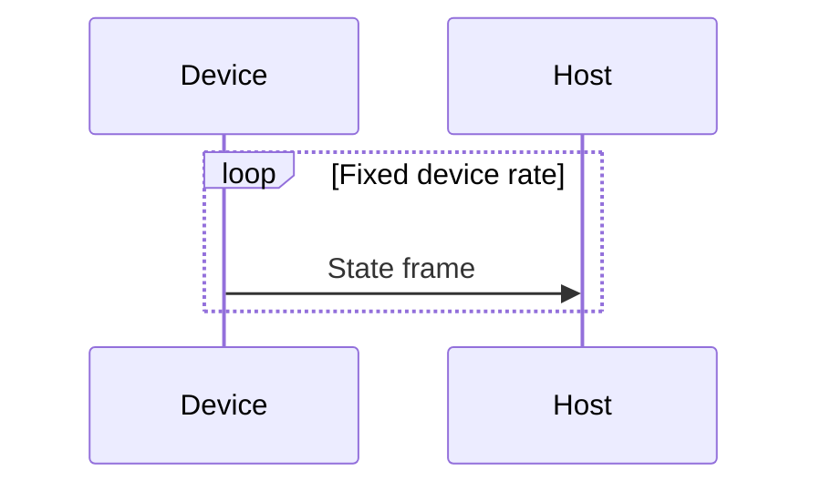

For a periodic sensor, frames should appear without sending anything.

Examples:

```text
- IMU
- force sensor
- tactile sensor board
- encoder board
```

If no frames appear, check power, bitrate, device mode, wiring, and termination.

### Query-Response

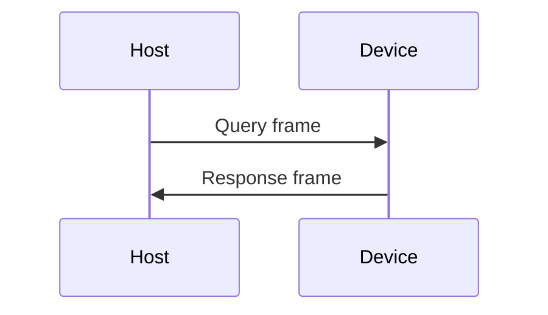

For a query-response device, `candump` may show nothing until a query is sent.

Example checks:

```text
- send device status query
- request firmware version
- request diagnostic register
- request encoder value
```

If the query frame is visible but no response appears, check CAN ID, device ID, mode, bitrate, and ACK/error counters.

### Command-Response

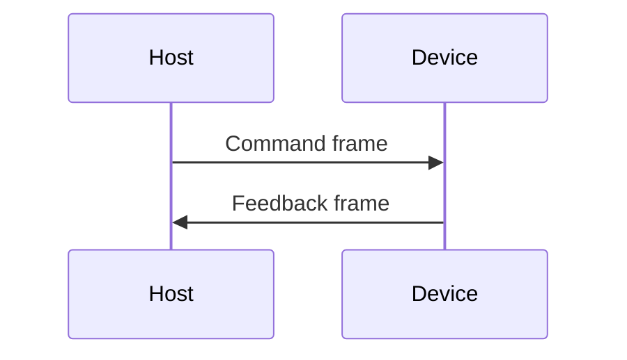

Many motor drivers use this pattern.

A motor may not send full feedback until it receives a valid command or enters the correct operation mode.

If the command frame is visible but no feedback appears, check:

```text
- command ID
- device ID
- enable sequence
- operation mode
- command payload
- watchdog timeout
- driver fault state
```

## Step 3: Check the CAN Interface State

If raw traffic is missing, check the host-side CAN interface.

On Linux:

```bash
ip -details link show can0
```

Useful fields include:

```text
- interface state
- bitrate
- sample point
- restart-ms
- RX/TX packet counts
- RX/TX error counters
- bus-off state
```

A healthy interface should normally be `UP` and `ERROR-ACTIVE`.

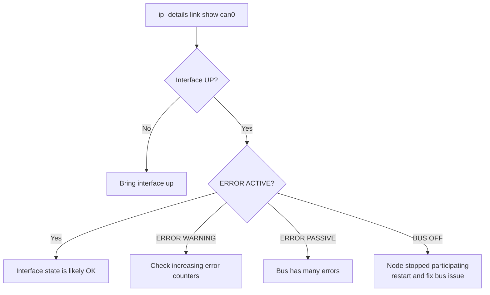

Bring up the interface with the correct bitrate.

```bash
sudo ip link set can0 down
sudo ip link set can0 up type can bitrate 1000000
```

If the interface enters `BUS-OFF`, the node has observed too many CAN errors and stopped participating in the bus.

Common causes include:

```text
- wrong bitrate
- no ACK from other nodes
- CANH/CANL wiring problem
- missing or incorrect termination
- severe noise or signal integrity issue
```

## Step 4: Check Bitrate and CAN ID Assumptions

All nodes on the same CAN bus must use the same bitrate.

If the bitrate is wrong, the bus may show no useful frames, or the error counters may increase rapidly.

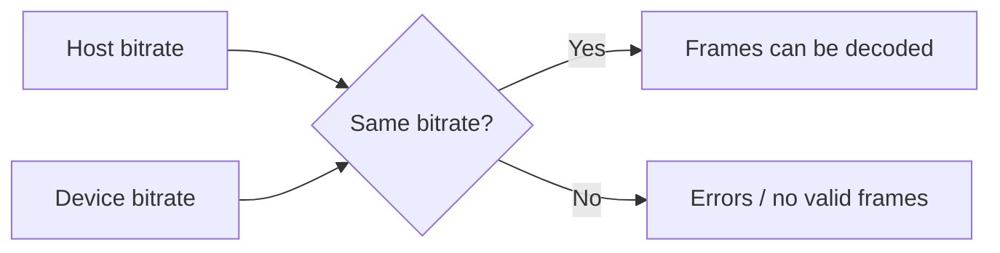

Also check CAN IDs.

A device may be working correctly but using a different ID than expected.

```text
Expected:
  motor feedback ID = 0x201

Observed:
  only 0x181 appears
```

This is not necessarily a hardware failure. It may be an ID map, device configuration, or firmware mode issue.

Check:

```text
- device ID DIP switch or EEPROM setting
- firmware default CAN ID
- command ID vs feedback ID
- standard ID vs extended ID
- bootloader ID vs runtime ID
```

## Step 5: Check Device Power and Mode

A CAN device can be physically connected but still not transmit useful frames.

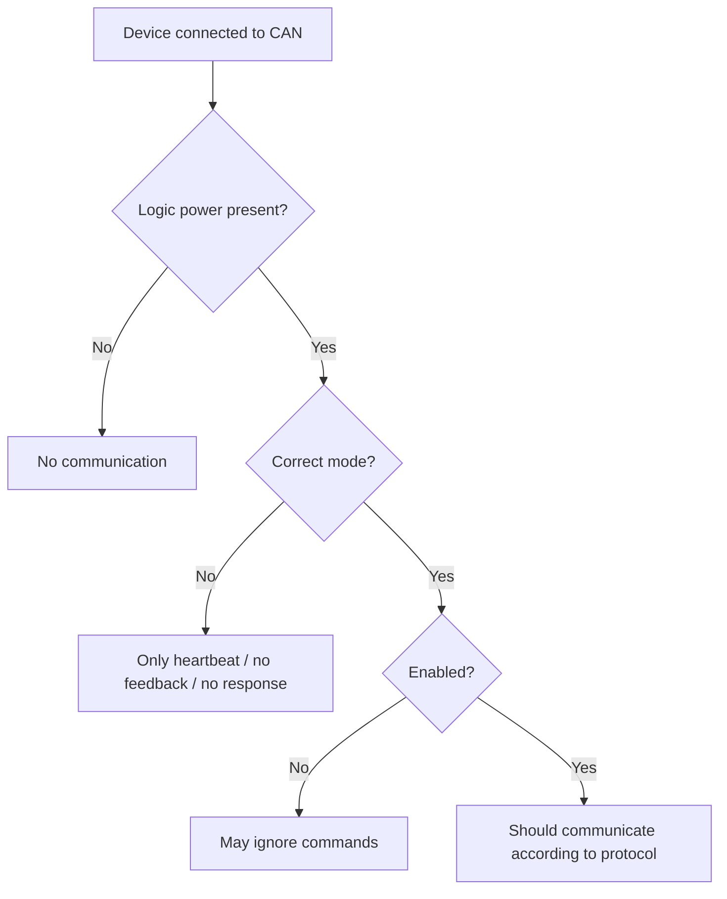

Check:

```text
- logic power
- motor power
- enable pin
- enable command
- emergency stop state
- boot mode
- firmware mode
- device ID configuration
- fault state
```

Many motor drivers do not send normal feedback until they are enabled. Some devices only transmit heartbeat frames before entering operation mode.

## Step 6: Check Wiring and Termination

If the software-visible state does not explain the issue, move to the physical bus.

Start with termination. This is still a low-effort check.

Power off the bus before measuring resistance.

Measure resistance between CANH and CANL.

```text
Expected:
  approximately 60 Ω
```

Typical readings:

```text
~60 Ω:
  two 120 Ω terminations are present

~120 Ω:
  only one termination is present

very high / open:
  no termination or open wiring

less than 60 Ω:
  too many terminations or possible short
```

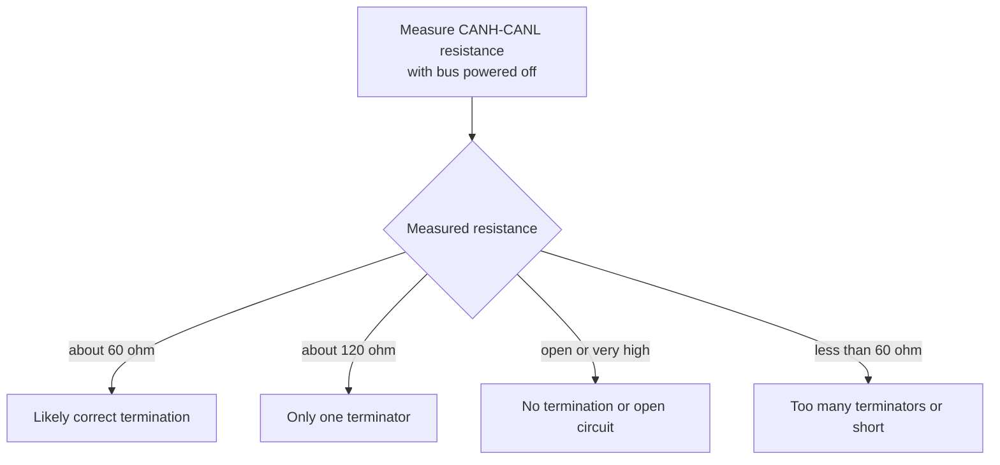

Then check wiring.

```text
- CANH to CANH
- CANL to CANL
- common ground when required
- connector pinout
- shield connection
- cable length
- branch length
- loose contacts
```

Swapped CANH/CANL is common.
Loose connectors are also common in robot prototypes because cables move, bend, and pull during testing.

## Step 7: Check Error Counters

If frames appear intermittently or the interface enters error states, check the error counters.

```bash
ip -details link show can0
```

Rough interpretation:

```text
TX errors increasing:
  the adapter may be transmitting but not receiving ACK

RX errors increasing:
  frames may be corrupted or sampled incorrectly

bus-off:
  too many errors; the controller stopped participating
```

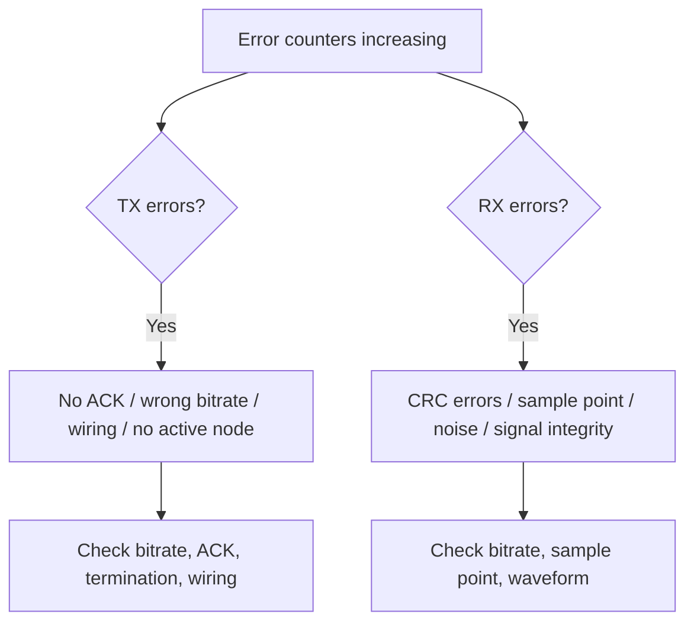

CAN frames are checked by the protocol, including CRC. Other nodes also acknowledge valid frames.

If a transmitter does not receive ACK, it treats the transmission as failed and increments error counters.

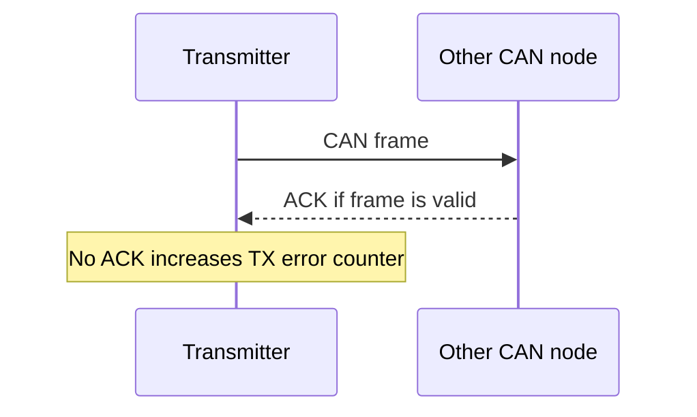

This means a node can attempt to send frames while still failing at the CAN protocol level.

## Step 8: Use an Oscilloscope

An oscilloscope is useful, but it should not be the first tool in this flow.

Use it when simpler checks cannot explain the failure.

Typical cases:

```text
- no frames are visible even though a device should transmit
- error counters increase
- the bus works with one device but fails with multiple devices
- communication works at low bitrate but fails at high bitrate
- communication is intermittent
- the robot works on the bench but fails after assembly
- long cables, custom connectors, or moving harnesses are used
```

At this point, inspect CANH and CANL directly.

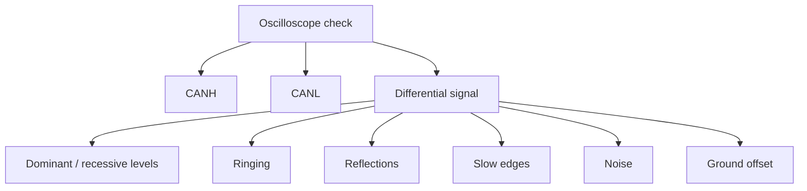

Check:

```text
- dominant and recessive levels
- differential voltage
- ringing
- reflections
- slow edges
- noise
- ground offset
- missing termination
- excessive termination
- connector or harness problems
```

If the waveform is wrong, software changes will not fix the problem.

## Step 9: Return to the Software

After raw CAN communication is verified, return to the software stack.

At this point, the question should be more specific than “the hardware is broken.”

Examples:

```text
The feedback frame arrives, but the decoded position is wrong.

The command frame is visible, but the driver does not leave idle mode.

The driver responds in PCAN-View, but not from my hardware interface.

The bus works with one actuator, but feedback becomes stale with eight actuators.

The command ID is correct, but the payload byte order is wrong.
```

Then inspect:

```text
- CAN ID map
- byte order
- scaling
- signed vs unsigned conversion
- standard vs extended ID
- command sequence
- actuator mode
- watchdog timeout
- TX pacing
- feedback timeout
- joint-to-actuator mapping
```

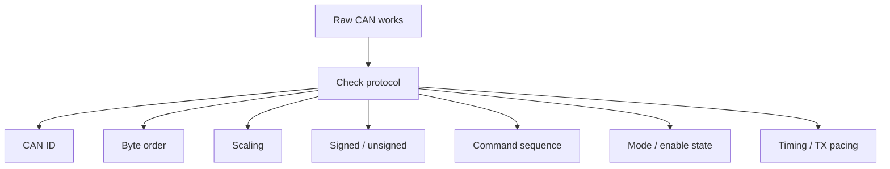

## Summary Checklist

Use this checklist from least invasive to most invasive.

```text
1. Observe raw CAN traffic with candump or PCAN-View.
2. Check whether expected IDs appear at the expected rate.
3. Identify the device I/O pattern: broadcast, query-response, or command-response.
4. Check the CAN interface state and bitrate.
5. Check device power, enable state, and firmware mode.
6. Check CAN ID assumptions.
7. Measure CANH-CANL termination resistance.
8. Check wiring, connectors, and grounding.
9. Check error counters and bus-off state.
10. Use an oscilloscope if software-visible evidence is insufficient.
11. Return to protocol and software debugging only after raw CAN behavior is verified.
```

The goal is not to prove that the hardware is broken.

The goal is to find the first observable layer where the system stops behaving as expected.

```text
A hardware failure should be the conclusion of the debugging process,
not the starting assumption.
```
